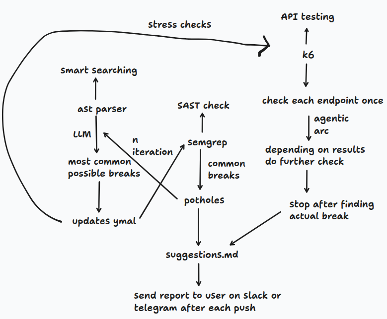
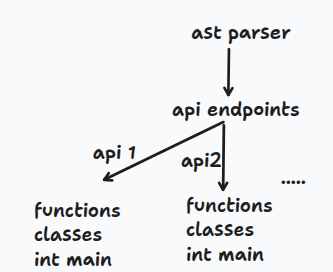
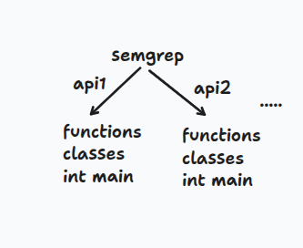
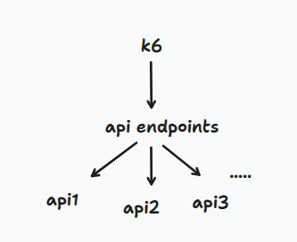

## Rough Workflow



### AST Parser Endpoint & Deep Dive


### Targeted Semgrep SAST on Extracted Components


### k6 Endpoint Load Testing


## Demo AST + Semgrep + k6 pipeline Result

```text
scan_results database is ready.
Found 5 route(s) in '/home/shreyas-nalle/Desktop/Rampling/Rampling/backend/demo_pipeline_check.py'
1 finding(s) in '/home/shreyas-nalle/Desktop/Rampling/Rampling/backend/demo_pipeline_check.py'.
[k6] /health: avg=2.1ms p90=2.8ms p95=3.6ms fail=0.00% rps=9.1
[k6] /products-fast: avg=3.4ms p90=4.7ms p95=6.1ms fail=0.00% rps=9.1
[k6] /products-n-plus-one: avg=13.6ms p90=28.1ms p95=33.4ms fail=0.00% rps=9.1
[k6] /random-fail: avg=2.2ms p90=4.1ms p95=4.6ms fail=18.73% rps=9.1
[k6] /slow-blocking: avg=1502.0ms p90=1502.7ms p95=1503.3ms fail=0.00% rps=9.1
[Report] Built 5 row(s).
Data base Inserted 5 row(s).  IDs: [36, 37, 38, 39, 40]

Routes: 5 | Findings: 1 | Inserted: 5 -> [36, 37, 38, 39, 40]
[
  {
    "scanned_at": "2026-09-07T13:34:40.152444+00:00",
    "target_file": "/home/shreyas-nalle/Desktop/Rampling/Rampling/backend/demo_pipeline_check.py",
    "route_method": "GET",
    "route_path": "/health",
    "route_function": "health",
    "semgrep_rule_id": null,
    "semgrep_file": null,
    "semgrep_line": null,
    "semgrep_message": null,
    "severity": "INFO",
    "k6_avg_duration": 2.0888884010554096,
    "k6_p90_duration": 2.7962768000000002,
    "k6_p95_duration": 3.6041710999999963,
    "k6_req_failed": 0.0,
    "k6_rps": 9.143274584920627
  },
  {
    "scanned_at": "2026-09-07T13:34:40.152444+00:00",
    "target_file": "/home/shreyas-nalle/Desktop/Rampling/Rampling/backend/demo_pipeline_check.py",
    "route_method": "GET",
    "route_path": "/products-fast",
    "route_function": "products_fast",
    "semgrep_rule_id": null,
    "semgrep_file": null,
    "semgrep_line": null,
    "semgrep_message": null,
    "severity": "INFO",
    "k6_avg_duration": 3.4220092137203144,
    "k6_p90_duration": 4.692461199999999,
    "k6_p95_duration": 6.077389399999997,
    "k6_req_failed": 0.0,
    "k6_rps": 9.143274584920627
  },
  {
    "scanned_at": "2026-09-07T13:34:40.152444+00:00",
    "target_file": "/home/shreyas-nalle/Desktop/Rampling/Rampling/backend/demo_pipeline_check.py",
    "route_method": "GET",
    "route_path": "/products-n-plus-one",
    "route_function": "products_n_plus_one",
    "semgrep_rule_id": null,
    "semgrep_file": null,
    "semgrep_line": null,
    "semgrep_message": null,
    "severity": "INFO",
    "k6_avg_duration": 13.617117981530335,
    "k6_p90_duration": 28.129570399999995,
    "k6_p95_duration": 33.36598769999999,
    "k6_req_failed": 0.0,
    "k6_rps": 9.143274584920627
  },
  {
    "scanned_at": "2026-09-07T13:34:40.152444+00:00",
    "target_file": "/home/shreyas-nalle/Desktop/Rampling/Rampling/backend/demo_pipeline_check.py",
    "route_method": "GET",
    "route_path": "/slow-blocking",
    "route_function": "slow_blocking",
    "semgrep_rule_id": "testing_k6_semgrep_ast.blocking-sleep-in-route",
    "semgrep_file": "/home/shreyas-nalle/Desktop/Rampling/Rampling/backend/demo_pipeline_check.py",
    "semgrep_line": 52,
    "semgrep_message": "Blocking time.sleep() found in route function, this will block all the concurrent requests",
    "severity": "WARNING",
    "k6_avg_duration": 1501.976298989446,
    "k6_p90_duration": 1502.6781222,
    "k6_p95_duration": 1503.2584016,
    "k6_req_failed": 0.0,
    "k6_rps": 9.143274584920627
  },
  {
    "scanned_at": "2026-09-07T13:34:40.152444+00:00",
    "target_file": "/home/shreyas-nalle/Desktop/Rampling/Rampling/backend/demo_pipeline_check.py",
    "route_method": "GET",
    "route_path": "/random-fail",
    "route_function": "random_fail",
    "semgrep_rule_id": null,
    "semgrep_file": null,
    "semgrep_line": null,
    "semgrep_message": null,
    "severity": "INFO",
    "k6_avg_duration": 2.1962547229551452,
    "k6_p90_duration": 4.1218554,
    "k6_p95_duration": 4.6196292,
    "k6_req_failed": 0.18733509234828497,
    "k6_rps": 9.143274584920627
  }
]
```