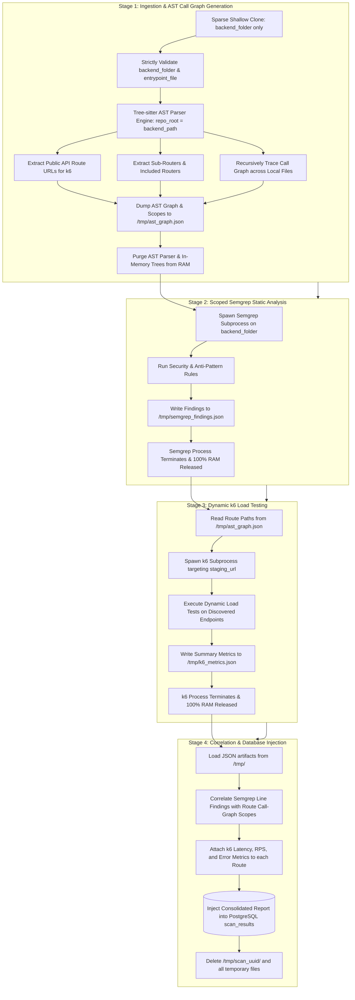

# Rampling

Automated API security and performance scanner combining AST-based route extraction, targeted static code analysis (SAST), and dynamic load testing.

---

## 1. Brief Introduction

**Rampling** is an automated, end-to-end API security and performance analysis engine. Designed as a cloud-hosted web service, Rampling bridges the gap between static code analysis and live performance testing. 

By analyzing backend application codebases, Rampling discovers API routes and their complete invocation call graphs, evaluates them for anti-patterns and vulnerabilities, and executes targeted dynamic load tests against live staging endpoints. All findings are correlated back to individual routes and persisted in a unified database for comprehensive reporting.

---

## 2. Problem and Solution

### The Problem
- **Decoupled Security and Performance**: Security teams run static application security testing (SAST) tools that report vulnerabilities in isolation without verifying real-world performance impact or runtime reachability. Meanwhile, performance engineers run dynamic load tests without visibility into underlying code anti-patterns (such as synchronous blocking calls, N+1 query loops, or unoptimized database access).
- **Manual Endpoint Cataloging**: Setting up load tests in tools like k6 typically requires manually writing scripts, discovering endpoints, and mapping URLs. As backends scale with nested sub-routers and dynamic handlers, keeping load test configurations in sync becomes error-prone and tedious.
- **Resource Constraints & OOM Failures in Cloud Deployments**: Running heavyweight static scanners (like Semgrep), AST graph parsers, and concurrent dynamic load generators (like k6) simultaneously inside resource-constrained environments (e.g., 512 MB PaaS tiers / containers) leads to disk exhaustion and Out-Of-Memory (OOM) crashes.
- **Monorepo Bloat**: Cloning massive repositories containing gigabytes of frontend frameworks, media assets, documentation, and build artifacts overwhelms memory and network bandwidth when only the backend code needs scanning.

### The Solution
- **Unified Route-Level Intelligence**: Rampling parses the abstract syntax tree (AST) of the backend to identify all exposed HTTP routes and trace their entire execution path across local functions and imported modules.
- **Automated Dynamic Load Testing**: Using the route paths extracted via AST, Rampling automatically configures and runs k6 dynamic load tests against the target staging environment—measuring request latency (avg, p90, p95), requests per second (RPS), and failure rates without manual script writing.
- **Correlated SAST & DAST Reporting**: Static vulnerabilities identified by Semgrep are scoped and correlated directly with the specific routes and execution branches responsible, combining static security warnings with live dynamic latency numbers.
- **Zero-Waste Sparse Ingestion & Strict Validation**: Rampling leverages shallow cloning with Git sparse checkout (`--depth 1 --filter=blob:none --sparse`) to download only the specified backend directory, followed by strict directory/entrypoint validation to eliminate false positives and resource waste.
- **Strict Sequential Lifecycle & Peak RAM Isolation**: Rampling runs each stage sequentially (AST $\rightarrow$ Semgrep $\rightarrow$ k6 $\rightarrow$ Correlation), serializing intermediate state to disk (`/tmp/*.json`) and purging processes from memory. Total memory footprint remains strictly under ~220 MB at all times, making it safe for 512 MB cloud tiers.

---

## 3. Workflow Explanation

Rampling processes scan requests through a strictly ordered 4-stage pipeline that ingests, analyzes, tests, and correlates code with live performance metrics.

### System Architecture & Workflow




### Stage 1: Ingestion & AST Call Graph Generation


- **Input Ingestion**: Accepts four core parameters: `repo_url`, `backend_folder`, `entrypoint_file`, and `staging_url`.
- **Sparse Checkout**: Performs a shallow sparse clone (`git clone --depth 1 --filter=blob:none --sparse`) and sets sparse checkout strictly to `backend_folder`. Files in `frontend/`, `docs/`, or test suites never touch the disk.
- **Strict Validation**: Enforces strict validation on `backend_folder` and `entrypoint_file`. If either is missing, the workspace is purged and an error is raised immediately without guesswork.
- **Tree-sitter AST Parsing**: Traverses the root router and mounted sub-routers (`include_router`), mapping out HTTP verbs (`GET`, `POST`, etc.) and endpoint paths.
- **Call-Graph Extraction**: Recursively traces function calls and cross-file imports to construct the full execution path and line number spans (`scoped_lines`) for every route.
- **Memory Release**: Saves the discovered route graph to `/tmp/ast_graph.json` and frees the AST parser from RAM via explicit garbage collection.

### Stage 2: Scoped Semgrep SAST Analysis


- **Targeted Execution**: Spawns Semgrep as an isolated subprocess focused strictly on `backend_folder`.
- **Vulnerability & Anti-Pattern Rules**: Scans for blocking calls in asynchronous routes (e.g., `time.sleep()`), N+1 query patterns, SQL injection, insecure imports, and unhandled exceptions.
- **Disk Offloading**: Dumps findings into `/tmp/semgrep_findings.json` and terminates the process, immediately returning all memory back to the operating system.

### Stage 3: Dynamic k6 Load Testing


- **Automated Target Generation**: Reads the extracted public endpoints from `/tmp/ast_graph.json` and mounts them against `staging_url`.
- **Load Execution**: Runs k6 in an isolated subprocess to generate dynamic concurrent traffic against each discovered route.
- **Metric Collection**: Gathers average duration, p90 and p95 latencies, request failure percentages, and throughput (RPS).
- **Disk Offloading**: Outputs summary metrics to `/tmp/k6_metrics.json` and terminates.

### Stage 4: Correlation & Database Injection

- **Route Attribution**: Correlates Semgrep static findings with routes by checking if any flagged code lines fall within a route's AST call-graph execution scope.
- **Metric Association**: Merges k6 performance metrics (avg, p90, p95, failure rate, RPS) into the corresponding route record.
- **Persistence**: Writes the consolidated JSON scan report into PostgreSQL (`scan_results`).
- **Lifecycle Cleanup**: Purges the ephemeral repository directory and `/tmp` files in a mandatory `finally` block, leaving zero disk artifacts behind.

---

## 4. The Result

The unified execution produces an actionable, route-by-route report connecting code-level SAST findings with dynamic latency metrics:

```text
scan_results database is ready.
Found 5 route(s) in '/home/shreyas-nalle/Desktop/Rampling/Rampling/backend/demo_pipeline_check.py'
1 finding(s) in '/home/shreyas-nalle/Desktop/Rampling/Rampling/backend/demo_pipeline_check.py'.
[k6] /health: avg=2.1ms p90=2.8ms p95=3.6ms fail=0.00% rps=9.1
[k6] /products-fast: avg=3.4ms p90=4.7ms p95=6.1ms fail=0.00% rps=9.1
[k6] /products-n-plus-one: avg=13.6ms p90=28.1ms p95=33.4ms fail=0.00% rps=9.1
[k6] /random-fail: avg=2.2ms p90=4.1ms p95=4.6ms fail=18.73% rps=9.1
[k6] /slow-blocking: avg=1502.0ms p90=1502.7ms p95=1503.3ms fail=0.00% rps=9.1
[Report] Built 5 row(s).
Data base Inserted 5 row(s).  IDs: [36, 37, 38, 39, 40]

Routes: 5 | Findings: 1 | Inserted: 5 -> [36, 37, 38, 39, 40]
[
  {
    "scanned_at": "2026-09-07T13:34:40.152444+00:00",
    "target_file": "/home/shreyas-nalle/Desktop/Rampling/Rampling/backend/demo_pipeline_check.py",
    "route_method": "GET",
    "route_path": "/health",
    "route_function": "health",
    "semgrep_rule_id": null,
    "semgrep_file": null,
    "semgrep_line": null,
    "semgrep_message": null,
    "severity": "INFO",
    "k6_avg_duration": 2.0888884010554096,
    "k6_p90_duration": 2.7962768000000002,
    "k6_p95_duration": 3.6041710999999963,
    "k6_req_failed": 0.0,
    "k6_rps": 9.143274584920627
  },
  {
    "scanned_at": "2026-09-07T13:34:40.152444+00:00",
    "target_file": "/home/shreyas-nalle/Desktop/Rampling/Rampling/backend/demo_pipeline_check.py",
    "route_method": "GET",
    "route_path": "/products-fast",
    "route_function": "products_fast",
    "semgrep_rule_id": null,
    "semgrep_file": null,
    "semgrep_line": null,
    "semgrep_message": null,
    "severity": "INFO",
    "k6_avg_duration": 3.4220092137203144,
    "k6_p90_duration": 4.692461199999999,
    "k6_p95_duration": 6.077389399999997,
    "k6_req_failed": 0.0,
    "k6_rps": 9.143274584920627
  },
  {
    "scanned_at": "2026-09-07T13:34:40.152444+00:00",
    "target_file": "/home/shreyas-nalle/Desktop/Rampling/Rampling/backend/demo_pipeline_check.py",
    "route_method": "GET",
    "route_path": "/products-n-plus-one",
    "route_function": "products_n_plus_one",
    "semgrep_rule_id": null,
    "semgrep_file": null,
    "semgrep_line": null,
    "semgrep_message": null,
    "severity": "INFO",
    "k6_avg_duration": 13.617117981530335,
    "k6_p90_duration": 28.129570399999995,
    "k6_p95_duration": 33.36598769999999,
    "k6_req_failed": 0.0,
    "k6_rps": 9.143274584920627
  },
  {
    "scanned_at": "2026-09-07T13:34:40.152444+00:00",
    "target_file": "/home/shreyas-nalle/Desktop/Rampling/Rampling/backend/demo_pipeline_check.py",
    "route_method": "GET",
    "route_path": "/slow-blocking",
    "route_function": "slow_blocking",
    "semgrep_rule_id": "testing_k6_semgrep_ast.blocking-sleep-in-route",
    "semgrep_file": "/home/shreyas-nalle/Desktop/Rampling/Rampling/backend/demo_pipeline_check.py",
    "semgrep_line": 52,
    "semgrep_message": "Blocking time.sleep() found in route function, this will block all the concurrent requests",
    "severity": "WARNING",
    "k6_avg_duration": 1501.976298989446,
    "k6_p90_duration": 1502.6781222,
    "k6_p95_duration": 1503.2584016,
    "k6_req_failed": 0.0,
    "k6_rps": 9.143274584920627
  },
  {
    "scanned_at": "2026-09-07T13:34:40.152444+00:00",
    "target_file": "/home/shreyas-nalle/Desktop/Rampling/Rampling/backend/demo_pipeline_check.py",
    "route_method": "GET",
    "route_path": "/random-fail",
    "route_function": "random_fail",
    "semgrep_rule_id": null,
    "semgrep_file": null,
    "semgrep_line": null,
    "semgrep_message": null,
    "severity": "INFO",
    "k6_avg_duration": 2.1962547229551452,
    "k6_p90_duration": 4.1218554,
    "k6_p95_duration": 4.6196292,
    "k6_req_failed": 0.18733509234828497,
    "k6_rps": 9.143274584920627
  }
]
```