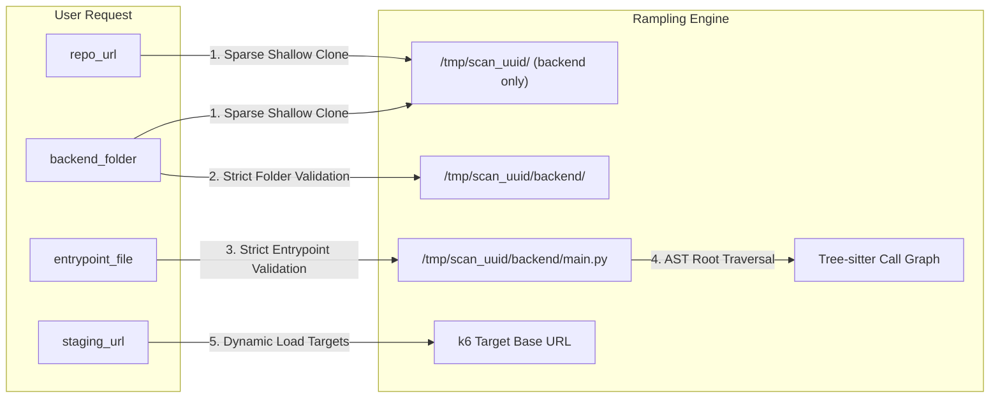
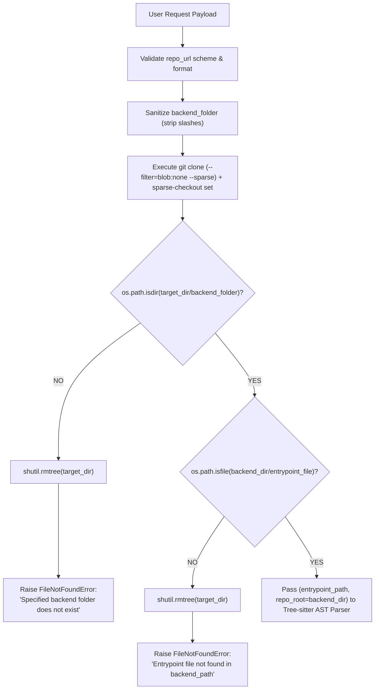
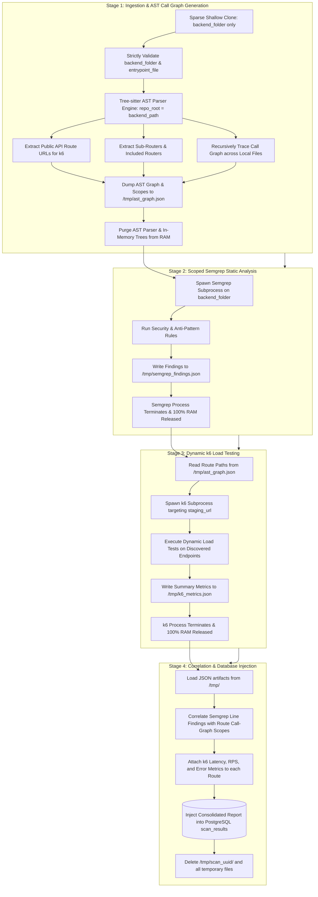

# Rampling Architecture & Memory Optimization Reference

This document outlines the operational workflow, cloud ingestion model, and memory management strategy for **Rampling**—an automated API security and performance scanner.

---

## 1. Hosted Web Service Model & User Input Specification

Rampling operates as a **cloud-hosted web service**. Users trigger an analysis by submitting a scan request through a web interface or API payload.

### The 4 Core User Inputs

| Parameter | Type | Example | Purpose |
| :--- | :--- | :--- | :--- |
| **`repo_url`** | `string` (URL) | `https://github.com/organization/web-app` | Remote Git repository containing the target codebase. |
| **`backend_folder`** | `string` (Path) | `backend` or `api/v1` | Subfolder where backend code resides. Ignores frontend assets, docs, and build files. |
| **`entrypoint_file`** | `string` (Filename) | `main.py`, `main.go`, or `server.js` | Specific file within `backend_folder` where root routes and server initialization occur. |
| **`staging_url`** | `string` (URL) | `https://staging-api.example.com` | Deployed staging endpoint that k6 hits for dynamic load testing. |

### API Ingestion Payload (Example)

```json
{
  "repo_url": "https://github.com/example-org/store-backend",
  "backend_folder": "backend",
  "entrypoint_file": "main.py",
  "staging_url": "https://staging.api.store.example.com"
}
```

### How Inputs Map to Pipeline Components



### Ingestion & Strict Validation Mechanism

Rampling strictly isolates and validates repository contents before any code analysis begins, handled within [`backend/git_cloner.py`](file:///home/shreyas-nalle/Desktop/Rampling/backend/git_cloner.py).

#### 1. Git Sparse Checkout (Backend Only)
In monorepo setups, repositories frequently bundle gigabytes of frontend frameworks (`frontend/`, `client/`, `node_modules/`), mobile applications, documentation, and static media. Downloading entire repositories into a RAM- and disk-constrained cloud instance (such as a 512 MB Render free tier or container) leads to network throttling, disk exhaustion, and out-of-memory crashes.

To eliminate unnecessary network overhead and disk consumption, Rampling combines **shallow cloning** with **Git sparse checkout** using a two-step sequence:

```bash
# Step 1: Clone repo structure with zero file blobs into an ephemeral workspace
git clone --depth 1 --filter=blob:none --sparse <repo_url> /tmp/rampling_repo_<uuid>/

# Step 2: Instruct Git to checkout and download blobs ONLY for the target backend folder
git -C /tmp/rampling_repo_<uuid>/ sparse-checkout set <backend_folder>
```

##### Technical Breakdown of Git Flags

| Flag / Command | Purpose | Memory & Disk Impact |
| :--- | :--- | :--- |
| **`--depth 1`** | Fetches only the single latest commit on the target branch, omitting entire Git revision history. | Drastically reduces `.git/objects/` size and download time. |
| **`--filter=blob:none`** | Tells Git to download *only commit and tree metadata*, skipping all file contents (blobs) during initial clone. | Git downloads 0 bytes of source files initially. |
| **`--sparse`** | Initializes the sparse-checkout configuration file in `.git/info/sparse-checkout` so working files are not populated. | Working directory starts empty. |
| **`sparse-checkout set <backend_folder>`** | Instructs Git to fetch blobs and populate working tree *exclusively* for `<backend_folder>`. | Files inside `frontend/`, `docs/`, `tests/` never touch the disk. |

##### Ephemeral Storage Allocation
Target repositories are cloned into temporary directories formatted as `/tmp/rampling_repo_<uuid>/` via Python's `tempfile.gettempdir()`. If any command fails during cloning, the directory is immediately purged with `shutil.rmtree()` and a `RuntimeError` is raised.

#### 2. Strict Validation Checks (No Baby-Sitting / No Guessing)

Following the cloud deployment model adopted by production PaaS platforms (Render, Vercel, Railway), Rampling enforces **strict path validation with zero heuristic guessing or auto-recovery**:



##### Validation Step A: Backend Folder Existence
Directly after `sparse-checkout set <backend_folder>` completes, `clone_repo()` verifies that the expected backend directory exists:
```python
clean_folder = backend_folder.strip("/").strip("\\").strip()
expected_backend_path = os.path.join(target_dir, clean_folder)

if not os.path.isdir(expected_backend_path):
    shutil.rmtree(target_dir, ignore_errors=True)
    raise FileNotFoundError(
        f"Specified backend folder '{clean_folder}' does not exist in repository '{repo_url}'."
    )
```
If the user provided an incorrect or misspelled folder name:
1. The temporary repository directory in `/tmp` is wiped immediately (`shutil.rmtree`).
2. An explicit `FileNotFoundError` is raised back to the caller / API client.

##### Validation Step B: Entrypoint File Existence Inside Backend Folder
Next, `resolve_paths()` verifies that the user-specified entrypoint file actually resides inside the validated `backend_path`:
```python
def resolve_paths(
    cloned_repo_path: str,
    backend_folder: str,
    entrypoint_file: str = "main.py",
) -> Tuple[str, str]:
    clean_folder = backend_folder.strip("/").strip("\\").strip()
    backend_path = os.path.join(cloned_repo_path, clean_folder)

    if not os.path.isdir(backend_path):
        raise FileNotFoundError(f"Backend directory not found: '{backend_path}'")

    entrypoint_path = os.path.join(backend_path, entrypoint_file)
    if not os.path.isfile(entrypoint_path):
        raise FileNotFoundError(
            f"Entrypoint file '{entrypoint_file}' not found in '{backend_path}'"
        )

    return os.path.abspath(backend_path), os.path.abspath(entrypoint_path)
```

##### Why Strict Validation is Enforced (The Render/PaaS Model)
1. **Deterministic Execution**: In monorepos, codebases may contain multiple files named `main.py`, `app.py`, `server.js`, or `index.js` across backend, frontend, scripts, and microservices. Attempting heuristic guessing or search fallbacks leads to scanning the wrong service or sub-component.
2. **Preventing False Negatives**: If the AST parser runs against a guessed entrypoint that isn't the true router root, it will detect 0 routes, leading to an empty, misleading security/load test report.
3. **Fail-Fast Efficiency**: By verifying both the directory and the entrypoint file before running Tree-sitter, Semgrep, or k6, CPU and memory resources are never wasted on malformed requests.

#### 3. Bridge to the Tree-sitter AST Parser Engine

Once both validation checks pass, `ingest_and_extract_routes()` directly hands the verified paths to the AST extraction engine:

```python
def ingest_and_extract_routes(
    repo_url: str,
    backend_folder: str,
    entrypoint_file: str = "main.py",
    output_json: Optional[str] = "/tmp/ast_graph.json",
) -> Tuple[List[Dict[str, Any]], str, str, str]:
    # 1. Sparse clone strictly the backend folder
    cloned_repo_dir = clone_repo(repo_url=repo_url, backend_folder=backend_folder)

    # 2. Strictly validate backend folder and entrypoint file
    backend_dir, entrypoint_path = resolve_paths(
        cloned_repo_path=cloned_repo_dir,
        backend_folder=backend_folder,
        entrypoint_file=entrypoint_file,
    )

    # 3. Direct Tree-sitter AST parser to entrypoint with repo_root scoped to backend_dir
    from AST import extract_routes

    routes = extract_routes(
        filepath=entrypoint_path,
        repo_root=backend_dir,
    )

    # 4. Offload call graph to disk for Stage 2 & Stage 3 consumption
    if output_json:
        with open(output_json, "w", encoding="utf-8") as f:
            json.dump(routes, f, indent=2)

    return routes, cloned_repo_dir, backend_dir, entrypoint_path
```

- **`repo_root=backend_dir`**: Ensures all cross-file relative imports (e.g., `from routers.users import router` or `const authRouter = require('./routes/auth')`) resolve accurately within the isolated backend folder.
- **Disk-backed Serialization**: Routes and their call graph scopes are serialized directly to `/tmp/ast_graph.json`.
- **`backend_dir` Preservation**: Returned to `main.py` so Stage 2 (Semgrep) can target `backend_dir` directly instead of searching nonexistent parent or sibling folders.
- **Mandatory Lifecycle Cleanup**: `main.py` wraps the entire workflow in a `try...finally` block, calling `cleanup_repo(cloned_dir)` upon completion or exception to guarantee 100% ephemeral workspace cleanup.

---

## 2. End-to-End Pipeline Workflow

The pipeline executes sequentially in four distinct stages:



### Stage Breakdown

1. **Ingestion & AST Call-Graph Extraction**:
   - The remote repository is cloned into an ephemeral workspace (`/tmp/scan_<uuid>/`) using **sparse checkout restricted to `backend_folder`**.
   - `resolve_paths()` strictly verifies that `backend_folder` and `entrypoint_file` exist on disk (raising `FileNotFoundError` if absent).
   - Tree-sitter is directed to `entrypoint_file` with `repo_root=backend_path`.
   - Discovers all root routes (e.g., `GET /products`, `POST /checkout`) and mounted sub-routers (`include_router`).
   - Recursively traces function invocations through local functions and cross-file imports to construct the full call branch for every route.
   - Collects an all-inclusive list of code line ranges (`scoped_lines`) for each route.
   - Serializes the output to `/tmp/ast_graph.json` and frees the AST parser from memory.

2. **Scoped Semgrep SAST Scan**:
   - Semgrep runs in an isolated subprocess restricted to `backend_folder`.
   - Checks code against rule definitions (e.g., blocking calls in async routes, N+1 query patterns, SQL injection, insecure imports).
   - Dumps raw findings to `/tmp/semgrep_findings.json` and terminates immediately.

3. **k6 Dynamic Performance Testing**:
   - The pipeline reads the public endpoint paths from `/tmp/ast_graph.json`.
   - k6 runs in an isolated subprocess, executing HTTP load tests against `staging_url + route_path`.
   - Measures p90/p95 response times, request throughput (RPS), and failure rates per tagged route.
   - Dumps summary metrics to `/tmp/k6_metrics.json` and terminates immediately.

4. **Correlation & Database Injection**:
   - The scanner merges the three intermediate JSON files:
     - Routes whose execution branches touch lines flagged by Semgrep are attributed directly with that vulnerability.
     - Dynamic performance metrics from k6 are associated with the corresponding route record.
   - The consolidated report is committed to PostgreSQL (`scan_results`).
   - The cloned repo directory and all temporary `/tmp` files are deleted.

---

## 3. Effective RAM Management Strategy

In resource-constrained environments (such as a 512 MB Render instance or small container), running static code analyzers and dynamic load engines simultaneously causes Out-Of-Memory (OOM) crashes.

Rampling prevents OOM failures using **four architectural principles**:

### 1. Strict Sequential Execution (Peak RAM Isolation)

Each memory-intensive component executes as a standalone process in its own stage. They **never run in parallel**.

```
RAM Usage Timeline (Operating within 512MB Container Limit)

 512MB ─────────────────────────────────────────────────────────── [Container Limit]
       
 200MB ┤                                     ┌─── k6 Subprocess ───┐
       │                                     │  (peaks ~180MB)     │
 120MB ┤                  ┌─ Semgrep Subprocess ─┐│                │
       │                  │  (peaks ~120MB)      ││                │
  25MB ┤ ┌─ AST Engine ─┐ │                      ││                │ ┌─ Correlate & DB ─┐
       │ │ (peaks ~20MB)│ │                      ││                │ │  (peaks ~25MB)   │
   0MB ┴─┴──────────────┴─┴──────────────────────┴┴────────────────┴─┴──────────────────┴──> Time
            Stage 1               Stage 2              Stage 3            Stage 4
```

- **Stage 1 (AST)**: Light Python footprint (~15–25 MB).
- **Stage 2 (Semgrep)**: Standalone binary execution (~100–150 MB). Peak memory drops to near zero once the process finishes.
- **Stage 3 (k6)**: Standalone Go binary load testing (~120–200 MB). Peak memory drops to near zero once the process finishes.
- **Stage 4 (Report Merge)**: Lightweight dictionary lookup and SQL insert (~20–30 MB).

Because peak memory never stacks, total usage remains well under **~220 MB at all times**.

### 2. Disk-Backed Intermediate State (`/tmp/*.json`)

Rather than keeping large in-memory objects across stages, components communicate using temporary files in `/tmp`:

- `Stage 1` writes $\rightarrow$ `/tmp/ast_graph.json`
- `Stage 2` writes $\rightarrow$ `/tmp/semgrep_findings.json`
- `Stage 3` writes $\rightarrow$ `/tmp/k6_metrics.json`

#### Why JSON is the Optimal Serialization Choice

| Metric | Measured Footprint | Assessment |
| :--- | :--- | :--- |
| **Typical Route Tree Size** | ~1.5 KB to 3 KB per route | Negligible |
| **50-Endpoint Backend Project** | ~75 KB to 150 KB total JSON | Fraction of 1 megabyte |
| **RAM Retention** | 0 MB held in memory between stages | Fully offloaded to disk |
| **Dependency Overhead** | Built-in Python standard library (`json`) | Zero third-party baggage |

### 3. Explicit Memory Deallocation & Garbage Collection

Between phases, Python's runtime memory is freed explicitly:

```python
# After building and writing AST graph to disk:
del ast_builder
del parsed_trees
gc.collect()  # Forces immediate release of Python heap allocations
```

### 4. Ephemeral Workspace Hygiene (Zero Disk Leakage)

Target repositories are cloned shallowly (`git clone --depth 1`) into `/tmp/scan_<uuid>/`. 

A mandatory `finally` block guarantees that the cloned source code and all intermediate JSON artifacts are deleted immediately after scan completion or upon error:

```python
try:
    # Execute Pipeline: AST -> Semgrep -> k6 -> DB
    ...
finally:
    shutil.rmtree(temp_scan_dir, ignore_errors=True)
```

This ensures the container's disk remains clean and prevents filesystem exhaustion across successive scans.
