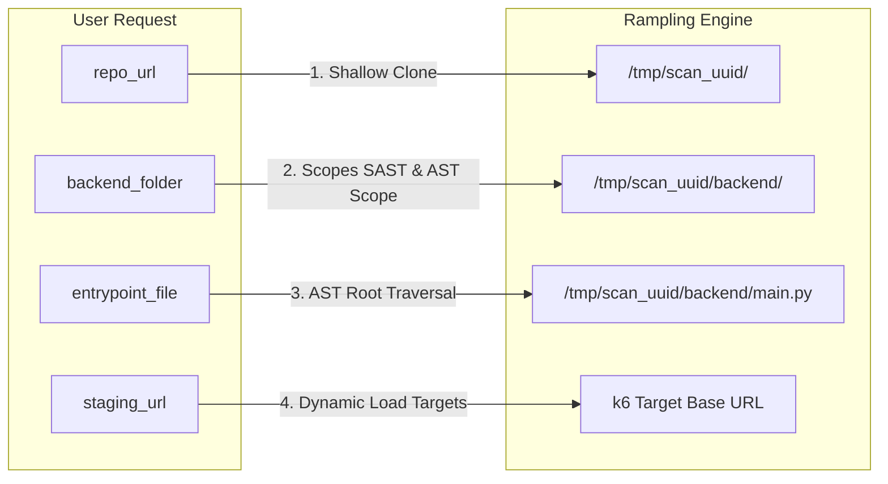
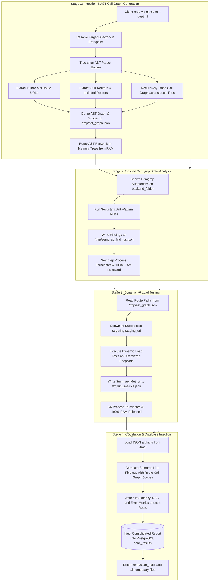

# Rampling Architecture & Memory Optimization Reference

This document outlines the operational workflow, cloud ingestion model, and memory management strategy for **Rampling**—an automated API security and performance scanner.

---

## 1. Hosted Web Service Model & User Input Specification

Rampling operates as a **cloud-hosted web service**. Users trigger an analysis by submitting a scan request through a web interface or API payload.

### The 4 Core User Inputs

| Parameter | Type | Example | Purpose |
| :--- | :--- | :--- | :--- |
| **`repo_url`** | `string` (URL) | `https://github.com/organization/web-app` | Remote Git repository containing the target codebase. |
| **`backend_folder`** | `string` (Path) | `backend` or `api/v1` | Subfolder where backend code resides. Ignores frontend assets, docs, and build files. |
| **`entrypoint_file`** | `string` (Filename) | `main.py`, `main.go`, or `server.js` | Specific file within `backend_folder` where root routes and server initialization occur. |
| **`staging_url`** | `string` (URL) | `https://staging-api.example.com` | Deployed staging endpoint that k6 hits for dynamic load testing. |

### API Ingestion Payload (Example)

```json
{
  "repo_url": "https://github.com/example-org/store-backend",
  "backend_folder": "backend",
  "entrypoint_file": "main.py",
  "staging_url": "https://staging.api.store.example.com"
}
```

### How Inputs Map to Pipeline Components



---

## 2. End-to-End Pipeline Workflow

The pipeline executes sequentially in four distinct stages:



### Stage Breakdown

1. **Ingestion & AST Call-Graph Extraction**:
   - The remote repository is shallow-cloned (`--depth 1`) into an ephemeral workspace (`/tmp/scan_<uuid>/`).
   - Tree-sitter begins parsing at `entrypoint_file` (e.g., `main.py`).
   - Discovers all root routes (e.g., `GET /products`, `POST /checkout`) and mounted sub-routers (`include_router`).
   - Recursively traces function invocations through local functions and cross-file imports to construct the full call branch for every route.
   - Collects an all-inclusive list of code line ranges (`scoped_lines`) for each route.
   - Serializes the output to `/tmp/ast_graph.json` and frees the AST parser from memory.

2. **Scoped Semgrep SAST Scan**:
   - Semgrep runs in an isolated subprocess restricted to `backend_folder`.
   - Checks code against rule definitions (e.g., blocking calls in async routes, N+1 query patterns, SQL injection, insecure imports).
   - Dumps raw findings to `/tmp/semgrep_findings.json` and terminates immediately.

3. **k6 Dynamic Performance Testing**:
   - The pipeline reads the public endpoint paths from `/tmp/ast_graph.json`.
   - k6 runs in an isolated subprocess, executing HTTP load tests against `staging_url + route_path`.
   - Measures p90/p95 response times, request throughput (RPS), and failure rates per tagged route.
   - Dumps summary metrics to `/tmp/k6_metrics.json` and terminates immediately.

4. **Correlation & Database Injection**:
   - The scanner merges the three intermediate JSON files:
     - Routes whose execution branches touch lines flagged by Semgrep are attributed directly with that vulnerability.
     - Dynamic performance metrics from k6 are associated with the corresponding route record.
   - The consolidated report is committed to PostgreSQL (`scan_results`).
   - The cloned repo directory and all temporary `/tmp` files are deleted.

---

## 3. Effective RAM Management Strategy

In resource-constrained environments (such as a 512 MB Render instance or small container), running static code analyzers and dynamic load engines simultaneously causes Out-Of-Memory (OOM) crashes.

Rampling prevents OOM failures using **four architectural principles**:

### 1. Strict Sequential Execution (Peak RAM Isolation)

Each memory-intensive component executes as a standalone process in its own stage. They **never run in parallel**.

```
RAM Usage Timeline (Operating within 512MB Container Limit)

 512MB ─────────────────────────────────────────────────────────── [Container Limit]
       
 200MB ┤                                     ┌─── k6 Subprocess ───┐
       │                                     │  (peaks ~180MB)     │
 120MB ┤                  ┌─ Semgrep Subprocess ─┐│                │
       │                  │  (peaks ~120MB)      ││                │
  25MB ┤ ┌─ AST Engine ─┐ │                      ││                │ ┌─ Correlate & DB ─┐
       │ │ (peaks ~20MB)│ │                      ││                │ │  (peaks ~25MB)   │
   0MB ┴─┴──────────────┴─┴──────────────────────┴┴────────────────┴─┴──────────────────┴──> Time
            Stage 1               Stage 2              Stage 3            Stage 4
```

- **Stage 1 (AST)**: Light Python footprint (~15–25 MB).
- **Stage 2 (Semgrep)**: Standalone binary execution (~100–150 MB). Peak memory drops to near zero once the process finishes.
- **Stage 3 (k6)**: Standalone Go binary load testing (~120–200 MB). Peak memory drops to near zero once the process finishes.
- **Stage 4 (Report Merge)**: Lightweight dictionary lookup and SQL insert (~20–30 MB).

Because peak memory never stacks, total usage remains well under **~220 MB at all times**.

### 2. Disk-Backed Intermediate State (`/tmp/*.json`)

Rather than keeping large in-memory objects across stages, components communicate using temporary files in `/tmp`:

- `Stage 1` writes $\rightarrow$ `/tmp/ast_graph.json`
- `Stage 2` writes $\rightarrow$ `/tmp/semgrep_findings.json`
- `Stage 3` writes $\rightarrow$ `/tmp/k6_metrics.json`

#### Why JSON is the Optimal Serialization Choice

| Metric | Measured Footprint | Assessment |
| :--- | :--- | :--- |
| **Typical Route Tree Size** | ~1.5 KB to 3 KB per route | Negligible |
| **50-Endpoint Backend Project** | ~75 KB to 150 KB total JSON | Fraction of 1 megabyte |
| **RAM Retention** | 0 MB held in memory between stages | Fully offloaded to disk |
| **Dependency Overhead** | Built-in Python standard library (`json`) | Zero third-party baggage |

### 3. Explicit Memory Deallocation & Garbage Collection

Between phases, Python's runtime memory is freed explicitly:

```python
# After building and writing AST graph to disk:
del ast_builder
del parsed_trees
gc.collect()  # Forces immediate release of Python heap allocations
```

### 4. Ephemeral Workspace Hygiene (Zero Disk Leakage)

Target repositories are cloned shallowly (`git clone --depth 1`) into `/tmp/scan_<uuid>/`. 

A mandatory `finally` block guarantees that the cloned source code and all intermediate JSON artifacts are deleted immediately after scan completion or upon error:

```python
try:
    # Execute Pipeline: AST -> Semgrep -> k6 -> DB
    ...
finally:
    shutil.rmtree(temp_scan_dir, ignore_errors=True)
```

This ensures the container's disk remains clean and prevents filesystem exhaustion across successive scans.
